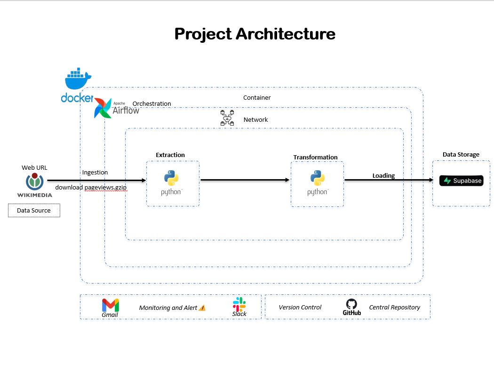
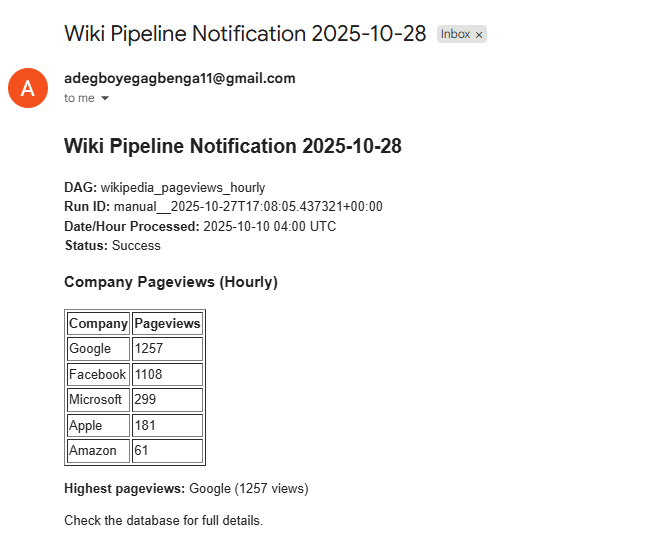
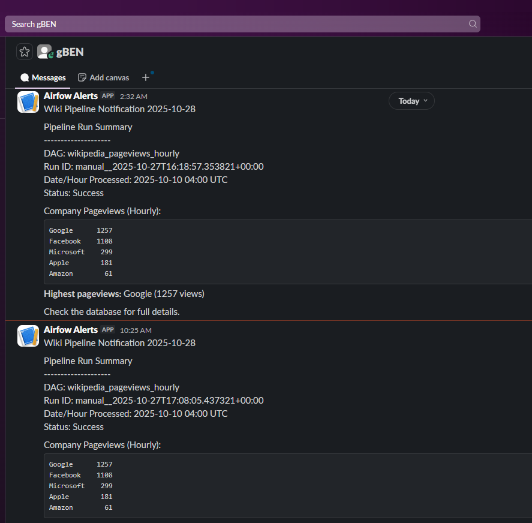
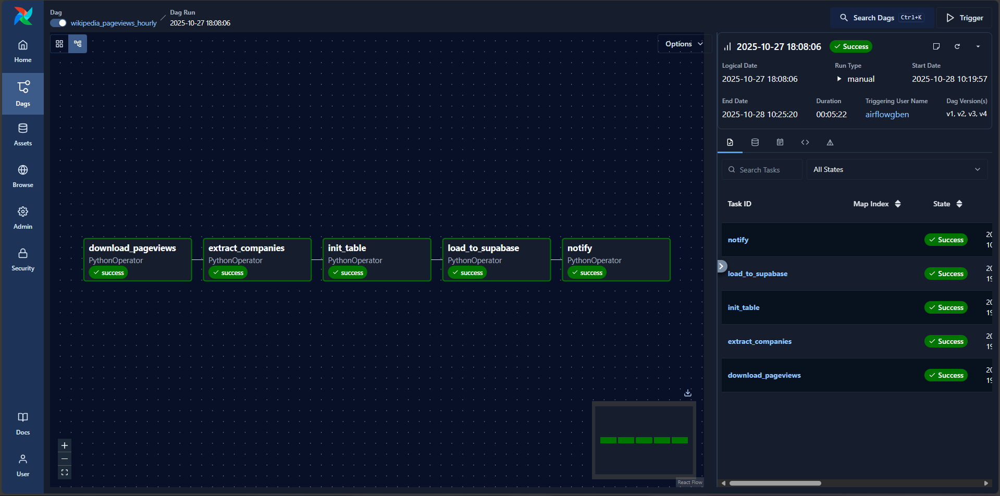
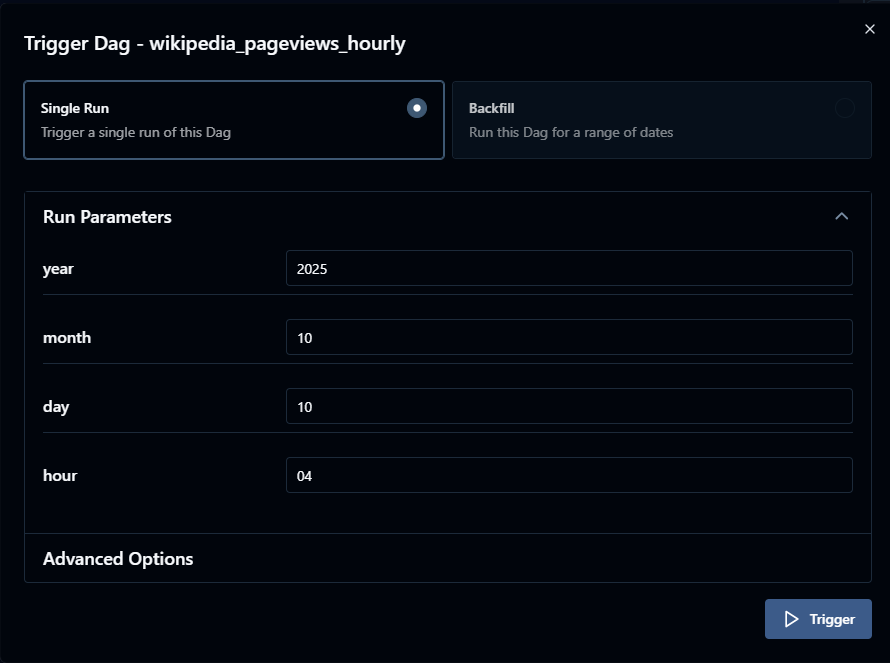

# CoreSentiment: Wikipedia Pageview Sentiment Analysis Pipeline

## Overview
The CoreSentiment project is a data engineering capstone designed to build a scalable data pipeline using Apache Airflow. This pipeline processes Wikipedia pageview data to extract sentiment indicators for stock market predictions, focusing on five major companies: Amazon, Apple, Facebook, Google, and Microsoft. By analyzing hourly pageview trends, the project aims to correlate increased pageviews with positive sentiment and potential stock price rises, while decreased views may indicate waning interest and price drops. The pipeline is containerized with Docker, orchestrated with Airflow's CeleryExecutor, and stores data in Supabase, with notifications via Slack and Gmail.

## Architecture


The architecture is structured as follows:
- **Data Source**: Wikimedia Foundation provides hourly pageview data in gzip format (e.g., `pageviews-20251010-040000.gz`) via a web URL[](https://dumps.wikimedia.org/other/pageviews/).
- **Orchestration**: Apache Airflow, running in a Dockerized environment with CeleryExecutor, manages the workflow.
- **Container & Network**: Docker containers handle extraction, transformation, and loading (ETL), connected via a bridge network.
- **Extraction**: Python scripts download and extract pageview data for a specified hour, filtering for the five target companies.
- **Transformation**: Data is processed to ensure consistency and relevance.
- **Loading**: Processed data is loaded into a Supabase database.
- **Data Storage**: Supabase serves as the persistent storage layer.
- **Monitoring & Alerts**: Slack and Gmail notify of pipeline status and failures.
- **Version Control**: GitHub hosts the central repository for code and documentation.
- **Central Repository**: GitHub ensures versioned tracking and collaboration.

## Prerequisites
- **Docker**: Version 20.10+ for containerization.
- **Docker Compose**: Version 2.0+ for multi-container management.
- **Python**: Version 3.9+ for script execution.
- **Git**: For cloning the repository.
- **PostgreSQL Client**: For optional manual database interaction.
- **Internet Connection**: To download Wikimedia data and send notifications.
- **Environment Variables**: Configure `.env` with credentials (e.g., `POSTGRES_USER`, `SUPABASE_PASSWORD`, `SLACK_WEBHOOK_URL`).

## Objectives
- Develop a robust Airflow DAG to ingest, process, and store Wikipedia pageview data for one hour in October 2025.
- Filter data for Amazon, Apple, Facebook, Google, and Microsoft to validate sentiment analysis hypotheses.
- Ensure pipeline reliability with retries, idempotence, and failure alerts.
- Provide a simple SQL analysis to identify the company with the highest pageviews per hour.
- Document the architecture and best practices for maintainability and scalability.

## Project Structure
CoreSentiment/
├── dags/                  # Airflow DAGs and include scripts
│   ├── wikipedia_pageviews_hourly_dag.py  # Main DAG
│   └── include/           # Reusable Python modules
│       ├── db.py          # Database operations
│       ├── download.py    # Data download logic
│       ├── extract.py     # Data extraction
│       ├── load.py        # Data loading
│       ├── notify.py      # Notification logic
│       └── utils.py       # Utility functions
├── Dockerfile             # Custom Airflow image build
├── docker-compose.yaml    # Docker Compose configuration
├── requirements.txt       # Python dependencies
├── .env                   # Environment variables
├── scripts/               # SQL scripts
│   ├── analysis.sql       # SQL query for pageview analysis
│   └── init_db.sql        # Database initialization script
└── README.md              # This file


## Key Best Practices Used
- **Airflow Parameters**: It enables you to insert parameters `year`, `month`, `day` and `hour` in case you want to run the dag for a different date and time.
- **Idempotence**: The `ON CONFLICT DO NOTHING` clause in `insert_records` prevents duplicate data insertion.
- **Retries**: DAG tasks include a `retries: 1` and `retry_delay: 300s` to handle transient failures.
- **Failure Alerts**: Slack and Gmail notifications trigger on pipeline completion or issues.
- **Modular Design**: Reusable Python modules in `include/` enhance maintainability.
- **Containerization**: Docker ensures consistent environments across development and deployment.
- **Logging**: Detailed logging in `download.py` aids troubleshooting.
- **Data Validation**: Basic file size checks in `download_pageviews` ensure data integrity.
- **Enabling AIRFLOW__CORE__FERNET_KEY**: It ensures that data encrypted using it cannot be manipulated or read without the key. This makes it a secure way to handle sensitive information.

## Monitoring and Alert
- **Email Alert**: 


- **Slack Alert**: 


## Airflow
- **DAGs**: 


- **Airflow Parameters**:


### Setup Instructions

1. Clone the Repository
```bash
git clone https://github.com/gBEN1-bit/cde-coresentiment-airflow-project.git
cd cde-coresentiment-airflow-project
```
2. Run this code to ggenerate your `AIRFLOW__CORE__FERNET_KEY`
```bash
python - <<EOF
from cryptography.fernet import Fernet
print(Fernet.generate_key().decode())
EOF
```
3. Complete the Configuration of the Environment Variables
Assign values to the variables in the .env file:
```bash
# Airflow settings
AIRFLOW_UID=50000
_AIRFLOW_WWW_USER_USERNAME=
_AIRFLOW_WWW_USER_PASSWORD=
AIRFLOW__CORE__FERNET_KEY=

# Airflow Postgres settings
POSTGRES_USER=
POSTGRES_PASSWORD=
POSTGRES_DB=airflowdb
POSTGRES_PORT=5432
POSTGRES_HOST=postgres

# Supabase (for DAGs to use)
SUPABASE_HOST=
SUPABASE_PORT=5432
SUPABASE_DB=postgres
SUPABASE_USER=
SUPABASE_PASSWORD=

# Local/output
OUTPUT_PATH=/opt/airflow/output

# Wikipedia hour input (for DAG params) sammple:
WIKI_YEAR=2025
WIKI_MONTH=10
WIKI_DAY=10
WIKI_HOUR=04

#Notification
# SMTP (Email)
SMTP_HOST=smtp.gmail.com
SMTP_PORT=465
SMTP_USER=
SMTP_PASSWORD=
ALERT_EMAIL=

# Slack
SLACK_WEBHOOK_URL=

```
4. Start Docker Desktop
Ensure Docker Desktop is running (Windows/macOS) or Docker daemon is active (Linux).

5. Run database migrations
```bash
docker compose up airflow-init
```
6. Run the Pipeline:
```bash
docker-compose up -d
```
This starts all the services in your `docker-compose.yaml` file and your airflow should be accessible via `http://localhost:8080/` where you can trigger your DAG.

## Troubleshooting
- **Log Retrieval Failure**: If logs show "No host supplied" (e.g., `http://:8793/log/...`), set `AIRFLOW__CORE__HOSTNAME_CALLABLE=airflow.utils.net.get_host_ip_address` in `.env` and restart services.
- **Download Errors**: Verify internet connectivity or increase `max_retries` in `download.py` if Wikimedia data is delayed.
- **Database Connection Issues**: Ensure `SUPABASE_HOST` and credentials in `.env` are correct; test with `psql` manually. This video could help on how to get your SUPABASE credentials[](https://www.youtube.com/watch?v=rcopl1rYn70).
- **Task Failures**: Check Airflow UI logs or worker logs for stack traces; adjust resource limits in `docker-compose.yaml` if needed.
- **Notification Failures**: Validate `SLACK_WEBHOOK_URL` or Gmail SMTP credentials in `.env`. This article could help you on how to get your slack webhooks[](https://www.maius.com/post/how-to-get-a-slack-webhook-url)

## Data Source
- **Source**: Wikimedia Foundation[](https://dumps.wikimedia.org/other/pageviews/).
- **Format**: Gzip-compressed text files (e.g., `pageviews-20251010-040000.gz`), ~50MB compressed, 200-250MB unzipped.
- **Structure**: Each line contains `domain`, `page_title`, `view_count`, and `response_size`, separated by whitespace.
- **Availability**: Data is released ~45 minutes post-hour, with occasional delays up to 3-4 hours.
- **Documentation**: https://meta.wikimedia.org/wiki/Research:Page_view, https://wikitech.wikimedia.org/wiki/Analytics/Data_Lake/Traffic/Pageviews.

## Contributing
1. Fork the repository on GitHub.
2. Clone your fork: `https://github.com/gBEN1-bit/cde-coresentiment-airflow-project.git`.
3. Create a branch: `git checkout -b feature-branch`.
4. Install dependencies: `pip install -r requirements.txt` (in a virtualenv or container).
5. Make changes and test locally with `docker-compose up --build`.
6. Commit changes: `git commit -m "Describe your changes"`.
7. Push to your fork: `git push origin feature-branch`.
8. Submit a pull request with a clear description of your changes.
9. Address feedback and iterate as needed.

This project welcomes enhancements, bug fixes, and documentation improvements.